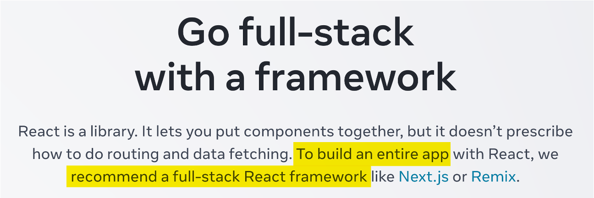
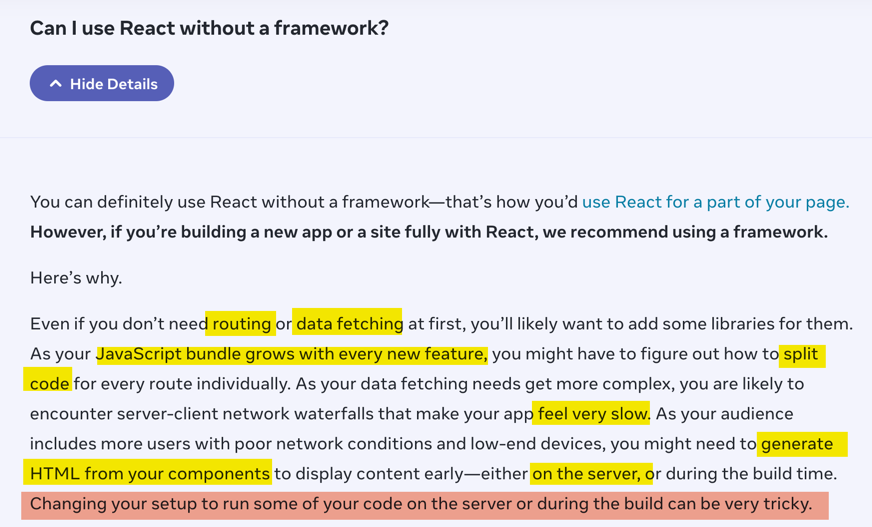
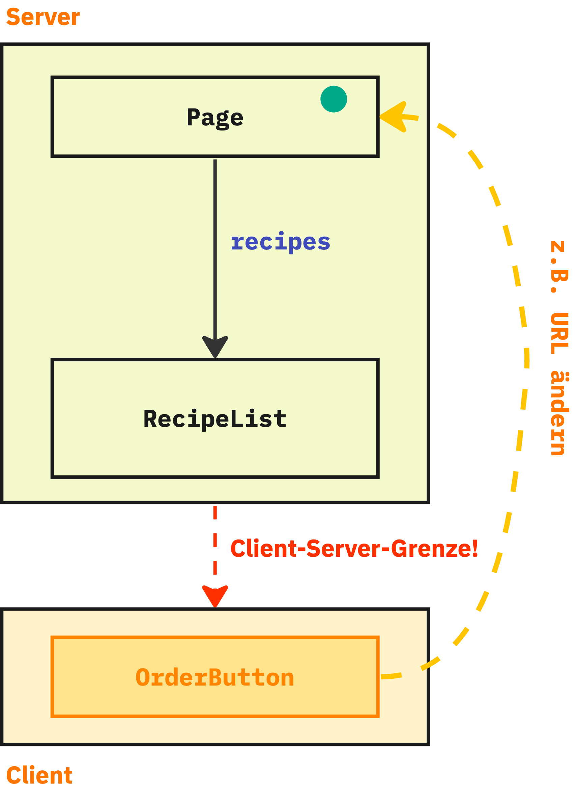
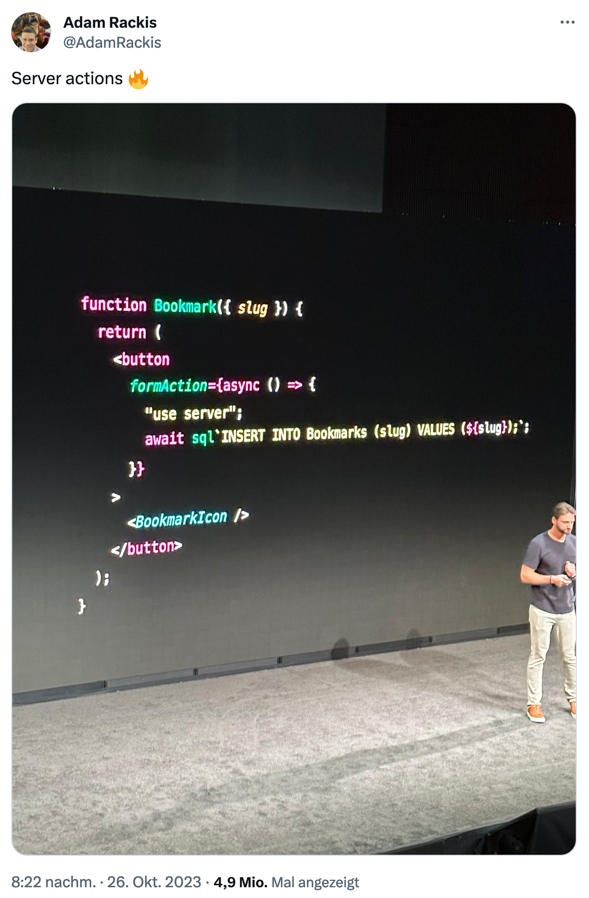

## März 2023...

## 

---

## React empfiehlt "Fullstack-Framework"



(https://react.dev/learn/start-a-new-react-project#can-i-use-react-without-a-framework)

---

### React empfiehlt "Fullstack-Framework"

- "Framework" ist verharmlosend, weil es sich in der Regel um einen kompletten Stack samt Build-Tools und Laufzeitumgebung handelt
- Deswegen werden solche Frameworks auch als "**Meta-Frameworks**" bezeichnet (=> Sammlung von Frameworks)
- [Next.js](https://nextjs.org/) entspricht den Vorstellungen des React-Teams
- [Remix](https://remix.run/) (vom React Router Team) unterstützt noch keine RSC, hat aber ähnliche Features
  - Unterstützung für RSC in Planung

---

## Next.js

- https://nextjs.org/
- Features:
  - Unterstützung für React Server Components
  - SSR
  - Static Rendering
  - Datei-basiertes Routing
  - Caching und Preloading

---

### Der Next.js Router

- [App-Router](https://nextjs.org/docs/app/building-your-application/routing): neuer Router (seit Version 13.4), der RSC unterstützt
  - (der "alte" `pages`-Router unterstützt keine RSC)
- File-system-basierter Router, der Code eurer Anwendung liegt unterhalb des Verzeichnisses `app`
- Unterhalb von `app` ist ein Verzeichnis eine **Route**, wenn darin eine `page.tsx`-Datei liegt
  - Dann ist dieses Verzeichnis vom Browser aufrufbar (`app/user/profile/page.tsx` -> Pfad im Browser: `/user/profile`)
  - `page.tsx` vergleichbar mit `index.html` in klassischem Web-Server
  - Verzeichnisse, die _keine_ `page.tsx`-Datei haben, tauchen zwar in der URL auf, können aber nicht aufgerufen werden
- Eine **Routen-Datei** muss per `default export` eine React-Komponente exportieren.
- Diese Komponente wird dargestellt, wenn die Route vom Browser angefordert wird
- ```tsx
  // /app/page.tsx
  export default function LandingPage() {
    return <h1>Hello World!</h1>;
  }

  // /app/recipes/page.tsx
  export default function RecipeListPage() {
    return <h1>Tasteful recipes 😋</h1>;
  }
  ```

---

### Der Next.js Router

- In einem Route-Verzeichnis kann es weitere Dateien geben, die einen festgelegten Namen haben und jeweils per `default export` eine React-Komponente zurückliefern:
- `layout.tsx`: Definiert die Layout-Komponente.
  - Damit kann über mehrere Routen ein einheitliches Layout festgelegt werden, denn wenn eine Seite gerendert wird, werden alle Layout-Komponenten aus den Pfaden darüber verwendet. So kann eine Hierarchie von Layouts gebaut werden.
- `loading.tsx`: Loading-Spinner o.ä., der dargestellt wird, bis die Seite gerendert werden kann (dazu später mehr)
- `error.tsx`: Eine Komponente, die als Error Boundary fungiert und gerendert wird, wenn beim Rendern der `page` ein Fehler aufgetreten ist
- `not-found.tsx`: Kann verwendet werden, um einen Fehler darzustellen, wenn eine Seite `notFound` zurückliefert

---

### Der Next.js Router: Layouts

- Jede Route kann eine Layout-Komponente haben
- Dieser Komponente wird die darzustellende Seite als `children`-Property übergeben
- ```tsx
  type MainLayoutProps = { children: React.ReactNode };

  export default function MainLayout({ children }: MainLayoutProps) {
    return <main>{children}</main>;
  }
  ```

- Layout-Komponenten können verschachtelt sein
- Wenn eine Route keine Layout-Komponente hat, wird im Baum oberhalb nach der nächstgelegenen Layout-Komponente gesucht
- Die Layout-Komponente für die Root-Route ist _pflicht_. Hier muss eine ganze HTML-Seite beschrieben werden
- ```tsx
  // /app/layout.tsx
  export default function Layout({children}: {children: ReactNode}) {
    return <html>
       <head><title>Recipify</title></head>
       <body>
         <header>Recipify!</header>
         <main>{children}</main>
       </body>
      <html>
  }
  ```

---

### Navigieren

- Zum Rendern von Links bringt Next.js eine eigene `Link`-Komponente mit
  - Mit einem entsprechenden Plug-in für TypeScript soll die sogar typsicher sein, so dass man keine Routen-Angaben hinschreiben kann, die es gar nicht gibt
    - (hat bei mir beim letzten Versuch nur eingeschränkt funktioniert)
- Verwendung ähnlich wie auch vom React Router (und `a`-Element) gewohnt:

- ```tsx
  import Link from "next/link";

  function RecipeLink( { recipeId } ) {
  return <Link href={`${/recipes/${receipeId}`}>Show recipe</Link>;
  }
  ```

---

### Übung: Vorbereitung #1

- **Klonen des Repositories**
- Bitte klonen: https://github.com/nilshartmann/nextjs-workshop
- In der [README.md-Datei](https://github.com/nilshartmann/nextjs-workshop/blob/main/README.md) findet ihr Hinweise zur Installation des Workspaces
- **Arbeitsverzeichnis**: Wir arbeiten ausschliesslich im Verzeichnis `workspace`
- ⚠️ Am besten nur das `workspace`-Verzeichnis in der IDE oder im Editor öffnen

---

### Warnung: Next.js Caching

- Achtung! Next.js hat sehr aggressives Caching eingebaut
- Wenn ihr "komisches" Verhalten feststellt, könnt ihr probieren:
  - Im Browser neuen Tab öffnen, oder in den Dev Tools Caching ausschalten oder Inkognito Modus verwenden
  - "Hard Refresh" im Browser machen
  - Verzeichnis `workspace/.next` löschen und Next.js neu starten

---

### Übung: Getting started!

<!-- .slide: class="small" -->

1. Baue die "Landing Page" für die Root-Route (`/`) im `app`-Verzeichnis

   - Die Seite muss nicht hübsch sein
   - heute gilt: wir machen Bauhaus-Style, "form follows function" 😉
   - unter `app/components` findest Du aber ein paar Basis-Komponenten (Button, Überschriften etc.), die Du benutzen kannst, wenn Du möchtest
   - Die Komponente soll einen Link auf `/recipes` rendern

2. Lege die Komponente für die Route `/recipes` an
   - Es reicht, wenn diese Komponente erstmal nur "Hello World" ausgibt.
   - In welches Verzeichnis muss die `page.tsx`-Datei für diese Route?
3. Wenn deine neuen Routen funktionieren:

   - Füge ein `console.log`-Statement in deine Komponenten hinzu, das beim Rendern die aktuelle Uhrzeit ausgibt
   - wo und wann wird das Log-Statement ausgegeben?

4. **Optional**: Kannst Du eine `layout`-Komponente bauen, die für Routen innerhalb `/recipes` gilt, aber nicht für die Root-Route (`/`)
   - Du kannst dir selbst ein einfaches Layout ausdenken, oder diese Komponente verwenden: `RecipesPageLayout`

- Mögliche Lösung findest Du in `schritte/10_routen_und_links`

---

# Recipify

## Was macht die Beispiel-Anwendung aus?

- Viel statischer Content
- Viel JavaScript
- ...gleichzeitig wenig Interaktion

---

## Anforderung

- Die Seiten sollen möglichst schnell für den Benutzer **sichtbar** und **bedienbar** sein

---

## Mögliche Probleme

- Viel JavaScript-Code, der...
  - ...vom Browser geladen werden muss
  - ...interpretiert und ausgeführt werden muss
  - ...mit jeder Komponente mehr wird

---

## Serverseitiges Rendern (SSR)

### Der Klassiker

1. Bei SSR wird die Anwendung auf dem Server ausgeführt

2. Der Server schickt **fertiges HTML** zum Client

- Gut: Client braucht HTML nur anzuzeigen (schnell!)
- Gut: Kein JavaScript für die Darstellung notwendig

3. Ebenfalls wird der **komplette Anwendungscode** zum Client geschickt

- 😢 Auch für statische Komponenten
- 😢 Bandbreite! Performance!

- 👉 SSR löst Probleme... aber nicht alle

---

## "Fullstack Architektur-Vision"

- [https://react.dev/learn/start-a-new-react-project#which-features-make-up-the-react-teams-full-stack-architecture-vision](https://react.dev/learn/start-a-new-react-project#which-features-make-up-the-react-teams-full-stack-architecture-vision)

---

## "Fullstack Architektur-Vision"

### <!-- .element: class="fragment" data-fragment-index="0" -->React Server Components (RSC)

- <!-- .element: class="fragment" data-fragment-index="1" -->Komponenten, die auf dem Server, Client und im Build gerendert werden können
- <!-- .element: class="fragment" data-fragment-index="2" -->Data Fetching "integriert"

### <!-- .element: class="fragment" data-fragment-index="3" --> Suspense

- Platzhalter für "langsame" Teile einer Seite
- Mit Streaming können diese Teile einer Seite "nachgeliefert" werden, sobald sie gerendert sind

---

## Zero-Bundle-Size

# React Server Components

---

### React Server Components

- **Idee:** Komponenten werden **nicht** im **Client** ausgeführt
- Sie stehen auf dem Client nur **fertig gerendert** zur Verfügung
- Der Server schickt lediglich _eine Repräsentation der UI_, aber _keinen JavaScript-Code_
- Das Format ist (im Gegensatz zu SSR) **nicht HTML**
- Kann aber mit SSR kombiniert werden
- React bzw. JavaScript muss also im Client laufen

---

### Arten von Komponenten

- **Client-Komponenten** (wie bisher)

- Werden auf dem **Client** gerendert
- oder auf dem **Server** 🙄

- Wie bisher:
  - JavaScript-Code wird vollständig zum Client gesendet
  - Der JavaScript-Code wird auf dem Client ausgeführt
  - Die Komponenten können interaktiv sein
    - Event-Listener etc.

---

### Arten von Komponenten

- **Neu: Server-Komponenten**

- werden auf dem **Server** gerendert
- oder im **Build** 🙄

- liefern UI (!) zum React-Client zurück (kein JavaScript-Code)
- Werden im Client nicht "ausgeführt"
- ...und können folglich nicht interaktiv sein (nur ohne JS)

---

### Arten von Komponenten

- Die Komponenten gemischt werden:
- Server-Komponenten können Client-Komponenten einbinden
  - (umgekehrt geht es nicht)
- Dann wird alles bis zur ersten Client-Komponente gerendert an den Client gesendet
  - (Mit SSR auch die Client-Komponenten)

---

# RSC am Beispiel Next.js

---

### Demo: Eine React Server Komponente

- **Alle** Komponenten in Next.js sind per Default **Server Components**
- Ausnahmen (Client Komponenten) müssen explizit gekennzeichnet werden (dazu später mehr)
- <!-- .element: class="demo" --> Landing-Page `/page.tsx`
- <!-- .element: class="demo" -->`/layout.tsx`
- <!-- .element: class="demo" -->`console.log` in `page`-Komponente

---

## Data Fetching

---

## Data Fetching

- Komponente, die Daten benötigen, können diese direkt _in der Komponente_ laden
- _Kann_ Latenz sparen und bessere Performance bringen

- "No Client-Server Waterfalls"

- Server Components können die Server-Infrastruktur nutzen (DB, Filesystem)

- 👉 Server-Komponenten können dazu _asynchron_ sein

---

## Data Fetching

### Demo: Eine asynchrone Server-Komponente

- React Server Componentens können asynchron sein!

- <!-- .element: class="demo" -->recipes/page.tsx anlegen

- <!-- .element: class="demo" -->DB-Zugriff mit `fetchRecipes`
- <!-- .element: class="demo" -->weiterhin eine statische Komponente bislang! Build! console.log!

---

### Asynchrone React Server Components

- React Server Components (RSC) werden **nicht auf dem Client** ausgeführt!
- Ihr könnt dort keine Event Handler etc. verwenden. Auch Hooks (z.B. `useState`) gehen nicht.
- Dafür könnt ihr eine RSC als `async function` implementieren
- Innerhalb der RSC könnt ihr dann mit Promises arbeiten und mit `await` auf diese warten
- Ihr könnt z.B. `fetch`-Aufrufe machen, Datenbank-Zugriffe oder die Node.JS API verwenden, um Dateien von der Festplatte zu lesen
- ```tsx
  export default async function RecipeList() {
    // Dieser Fetch-Call wird im Next.js-Backend (!) ausgeführt!
    const response = await fetch("http://localhost:8100/api/recipes");
    const recipes = await response.json();

    // ...
    return <RecipeList recipes={recipes} />;
  }
  ```

---

### Überbrücken der Wartezeit

- Was passiert, wenn wir die `RecipeList` (`/recipes`) aufrufen und der `fetch`-Call "lange" dauert? 🤔
- Was passiert, wenn wir die `/recipes`-Route zweimal hintereinander aufrufen? 🤔

---

### Platzhalter für Wartezeiten

- Während eine Route gerendert wird, kann Next.js eine Fallback- bzw. Platzhalter-Komponente anzeigen
- Diese wird solange dargestellt, bis alle Promises in der Routen-Komponente aufgelöst werden konnten
- Die Platzhalter-Komponente wird an derselben Stelle im Layout dargestellt, wie auch die Routen-Komponente
- Wenn die Routen-Komponente fertig gerendert wurde, wird nur der Bereich ausgetauscht
- Die Datei für eine Platzhalter-Komponente muss `loading.tsx` heißen und per `export default` eine Komponenten-Funktion exportieren
- Was du in dieser Komponente machst, bleibt dir überlassen
- `loading.tsx`-Dateien in tieferen Verzeichnissen überschreiben dabei `loading.tsx`-Dateien in höheren Verzeichnissen
  - oder umgekehrt: wenn in dem angeforderten Routen-Verzeichniskeine `loading.tsx`-Datei vorhanden ist, schaut Next.js in den höherliegenden Verzeichnissen
- wird keine `loading.tsx`-Datei gefunden, bleibt die Seite weiß...
- ```tsx
  // recipes/loading.tsx
  export default Loading() {
    return <div className={"LoadingSpinner"}>Please Wait...</div>
  }
  ```

---

### Caching

- **Caching** ist Next.js-spezifisch.
  - React macht keine Aussage, ob und wie Server Components oder Datenverkehr allgemein gecached werden soll.
- Eine einmal gerenderte Route wird von Next.js gecached.
- Das passiert im Browser und im Backend selbst
  - Wo und wie lange, hängt von einer ganzen Reihe von Faktoren ab
  - Zusätzlich werden auch die Ergebnisse von `fetch`-Aufrufen gecached
- Das Caching ist in der [Dokumentation beschrieben](https://nextjs.org/docs/app/building-your-application/caching)

---

### Rendering Modes in Next.js

<!-- .element: class="demo" -->nach Einzel-Seite

- Routen können **statisch** oder **dynamisch** gerendert werden:
  - Wenn Next.js alle Informationen zu einer Route schon zur Buildzeit hat, wird es eine **statische** Route.
  - Dynamische Routen werden bei jedem Request neu erzeugt (z.B. bei variablen Pfad-Segmenten)
  - Das lässt sich in beiden Fällen (zumindest teilweise) pro Route auch ändern

---

## Exkurs: zod

- Kennt ihr zod? https://zod.dev/ 🤔

---

# Zod

---

- "TypeScript-first schema validation with static type inference"
- https://zod.dev/

---

### TypeScript vs. JavaScript

<!-- .slide: class="left" -->

- Im folgenden ist mit **TypeScript** das Typsystem von TypeScript gemeint, das nur zur Buildzeit vorhanden ist
- Mit **JavaScript** ist der Code gemeint, den wir in JavaScript oder TypeScript schreiben, und der dann auch im Browser (als JavaScript) ausgeführt wird

* ```typescript
  // "TypeScript": zur Laufzeit weg
  type User = { lastname: string; firstname?: string };

  // "JavaScript"
  function login() {
    return { lastname: "Meier", firstname: null };
  }
  ```

---

### Problem: TypeScript-Typen sind zur Laufzeit weg

- Wenn man ein Objekt beschrieben hat, kann man das zur **Laufzeit** nicht mit TypeScript überprüfen
  - Hat uns der Server zur Laufzeit wirklich ein Objekt geschickt, das aussieht wie ein `User`?
- Für "echte" Validierungen sind TypeScript-Typen auch zu ungenau:
  - keine Wertebegrenzungen (bzw. nur sehr eingeschränkt)
  - Längen-Begrenzungen gibt es nicht
- Wenn man Validierung zur Laufzeit benötigt, kommt man um (JavaScript-)Code, der zur Laufzeit ausgeführt wird, nicht drumherum
- Also müssen die Validierungsregeln in JavaScript beschrieben werden.
- Dann sind diese aber redundant: in TypeScript (statische Typbeschreibung), in JavaScript zur Validierung während der Laufzeit

---

### Zod: Typen in JavaScript beschreiben und TS-Typen ableiten

- Aus dieser Not macht Zod eine Tugend:
- Wir beschreiben die Objekte in JavaScript...
- ...und können von der Beschreibung TypeScript Typen ableiten lassen
- ```typescript
  import { z } from "zod";

  const User = z.object({
    firstName: z.string(),
    lastName: z.string().nullish(),
  });

  type IUser = z.infer<typeof User>;
  ```

- Mit dem `User`-Objekt von zod können wir nun zur Laufzeit ein Objekt validieren
- Wenn das Objekt dem User-Schema entspricht, ist alles gut, sonst gibt es einen Fehler
- ```typescript
  const mayOrMayNotBeAUser = readUserFromServer();

  const user = User.parse(mayOrMayNotBeAUser);
  ```

- Die `parse`-Funktion fungiert gleichzeit als **Type Predicate Function**, so dass TypeScript
  danach auch weiß, wie `user` aussieht, unabhängig davon, was in `parse` übergeben wurde
- ```typescript
  declare function readUserFromServer(): unknown;

  const user = User.parse(readUserFromServer());
  //     ^? --> IUser
  ```

---

### Komplexe Regeln

- Mit Zod kann man die typischen Datentypen verwenden (Objekte, Arrays, string, number, boolean etc)
- Auch aus TypeScript bekannte Möglichkeiten wie `unions`, `extends`, `omit` oder `brand-Types` werden unterstützt
- Darüberhin kann man auch die gültigen Wertemengen und andere Constraints beschreiben
- ```typescript
  import { z } from "zod";

  const User = z.object({
    login: z.string().min(5),
    email: z.string().email(),
    status: z.string().emoji(), // 😊
    age: z.number().min(18).max(123),
  });
  ```

- Die `parse`-Funktion gibt dann detailierte Fehler, wenn ein überprüftes Objekt nicht diesen Regeln entspricht.
- Das funktioniert mittlerweile auch für das Validieren von Formularen in [React Hook Form
  ](https://react-hook-form.com/) mit dem [zod-Resolver](https://github.com/react-hook-form/resolvers#zod)

---

### Zod und Next.js

- Ob ihr Zod in eurer Anwendung einsetzt, bleibt natürlich euch überlassen
- In der Beispiel-Anwendung wird Zod verwendet, um Daten, die von der Backend API gelesen wurden zu validieren

---

### Übung: Asynchrone Server Komponenten

- **Baue die Komponente für die Rezept Übersicht (`/recipes`)**
- Du musst deine bestehende Komponente (`/app/recipes/page.tsx`) nun erweitern:
  - sie soll asynchron sein
  - Die Funktion zum Laden der Rezepte ist schon fertig: `fetchRecipes`
  - Die geladenen Rezepte kannst Du mit der ferigen Komponente `RecipeCard` rendern
- Baue eine `loading`-Komponente, die angezeigt wird, während die Daten geladen werden
  - Gib darin einfach "irgendwas" aus oder verwende die fertige Komponente `GlobalLodingIndicator`
  - Um die Komponente zu testen, kannst Du das Laden der Daten künstlich verzögern:
    - gehe dazu in `demo-config.ts` und setze `slowDown_GetRecipeList` z.B. auf `1600` (Verzögerung von 1,6 Sekunden)
- Du findest Ausgangsmaterial mit weiteren Hinweisen in `schritte/20_async_rsc/ausgang`
- Eine Lösung findest Du in `schritte/20_async_rsc/fertig`

---

### Mehr zu Next.js Routen

- Neben den "klassischen" Verzeichnisnamen, die URL-Segementen entsprechen, gibt es noch weitere Konventionen:
- Ein Pfad in Klammern (`(path)`) taucht in der URL nicht auf. Kann z.B. für eine gemeinsame Layout-Datei oder zur besseren Organisation verwendet werden, wenn man das nicht über die Hierarchie machen kann.
- ```typescript
  // /admin/user
  // /admin/articles
  // /admin/tags
  ```
- Wenn `articles` und `tags` sich ein Layout teilen soll (aber `/user` nicht), kann die Verzeichnisstruktur dafür so aussehen:
- ```typescript
  // /admin/user/page.tsx
  // /admin/(blog)/layout.tsx
  // /admin/(blog)/articles/page.tsx
  // /admin/(blog)/tags/page.tsx
  ```

---

### Mehr zu Next.js Routen

- Ein Pfad in eckigen Klammern (`/recipes/[recipeId]`) definiert einen Platzhalter. Der Wert für das Segment in der URL wird der Komponente dann zur Laufzeit als Property an die Routen-Komponente übergeben
- Die Properties, die eine Routen-Komponente bekommt, sind von Next.js vorgegeben
- Die Werte für die variablen Segmente werden als Objekt mit dem Namen `params` übergeben
- Darin enthalten ist der Wert für jedes variable Segment(`[recipeId]`) ohne die eckigen Klammern (`recipeId`):
- ```typescript
  // /app/recipes/[recipeId]/page.tsx

  type RecipePageProps = {
    params: { recipeId: string };
  };

  export default function RecipePage({ params }: RecipePageProps) {
    // params.recipeId enthält den Wert aus der URL (R1, R2, ...)
    const recipeId = params.recipeId;

    // ...
  }
  ```

---

### Mehr zu Next.js Routen

- Mit der `notFound`-Funktion kann die [`not-found`-Komponente](https://nextjs.org/docs/app/api-reference/file-conventions/not-found) gerendert werden
- Das ist zum Beispiel nützlich, wenn Daten geladen wurden, die es nicht gibt
- `notFound` bricht die Ausführung der Komponenten-Funktion ab, man braucht kein `return` hinzuschreiben
- ```tsx
  // /app/recipes/[recipeId]/page.tsx
  import { notFound } from "next/navigation";
  export default async function RecipePage({ params }: RecipePageProps) {
    const recipeId = params.recipeId;

    const recipe = await fetchRecipe(postId);
    if (!recipe) {
      notFound(); // kein return notwendig
    }

    return <Receipe recipe={recipe} />;
  }
  ```

- In der Datei `not-found.tsx` kannst Du dann per `export default` eine Komponente exportieren, die im Fehlerfall angezeigt wird
- ```tsx
  // /app/recipes/[recipeId]/not-found.tsx
  export default function RecipeNotFound() {
    return <div>Recipe not found :-(</div>;
  }
  ```

---

### Dynamische und statische Routen

- Durch die Verwendung eines Platzhalters wird eine Route zu einer dynamischen Route, d.h. sie wird **nicht** im Build gerendert, sondern **nur** zur Laufzeit
  - Next.js kann hier nicht im Vorwege wissen, welche Werte für das variable Segment verwendet werden
  - Mit `getStaticPaths` kann das geändert werden
- Auch die Verwendung einiger Next.js APIs führt dazu, dass eine Route nicht mehr statisch, sondern dynamisch ist
  - Das betrifft Funktionen, die mit Daten aus einem Request arbeiten (`headers()` und `cookies()`)
- Ggf. wird das Ergebnis auf dem Server gecached

---

### Übung: eine dynamische Route

- **Implementiere die Route zur Einzeldarstellung eines Rezepts**
- Das Verzeichnis ist `app/recipes/[recipeId]`
- Lies in der Komponente die `recipeId` aus dem `params`-Objekt das als `props` an die Komponente übergeben wird
- Dann kannst du die fertige Funktion `fetchRecipe` verwenden, um das Rezept zu laden
  - Wenn diese Funktion `null` zurückgibt, wurde das Rezept nicht gefunden, dann verwende `notFound()` um die Fehler-Komponente zu rendern
  - Wenn diese Funktion ein Rezept zurückliefert, kannst Du das an die fertige `RecipePageContent`-Komponente übergeben
- Was passiert, wenn ein Rezept nicht gefunden wurde? Testen kannst du das, in dem Du z.B. `/recipes/123` aufrufst
- Eine Lösung findest Du in `schritte/30_dynamic_segments`
- **Optional**: baue eine `not-found`-Komponente, die einen Fehler anzeigt, wenn ein Rezept nicht gefunden wurde

---

## Suspense

- Suspense unterbricht das Rendern, wenn in einer Komponente "etwas" fehlt
- "Etwas" ist im Fall von RSC ein Promise, das nicht aufgelöst ist
  - Am Beispiel der `loading`-Komponente haben wir das schon gesehen (dort aber abstrahiert von Next.js)
- Dazu kann um eine Komponente die `Suspense`-Komponente von React gelegt werden
- ```tsx
  async function loadData(...) {}

  async function RecipeList() {
    const posts = await loadRecipes();

    return <>...</>;
  }

  function RecipeListPage() {
    return <Suspense> fallback={"Please wait"}>
      <RecipeList />
    </Suspense>
  }
  ```

- Hier würde React zunächst die `fallback`-Komponente (`Please wait`) rendern und darstellen
- Wenn das Promise aufgelöst wird, rendert React dann die Komponente erneut für die finale Darstellung
- Das funktioniert mit "modernen" Bibliotheken übrigens auch in "klassischen" Single-Page-Anwendungen mit React
  - siehe zum Beispiel [useSuspenseQuery](https://tanstack.com/query/latest/docs/framework/react/reference/useSuspenseQuery) von TanStack/React Query

---

### Suspense in Next.js

- Um die oberste Komponente einer Route (`page.tsx`) legt Next.js eine automatisch eine `Suspense`-Komponente
- Den `fallback` dafür implementieren wir in der Datei `loading.tsx`, die eine Komponente per `default export` exportieren muss
- Konzeptionell sieht das so aus:

  - Eure Route:
  - ```tsx
    // loading.tsx
    export default function Spinner() {
      return "Please Wait";
    }

    // page.tsx
    export default async function RecipeListPage() {
      const data = await loadData();
      return <>...</>;
    }
    ```

  - Next.js (dummy code!!!)
  - ```typescript
    // Next.js (dummy code):
    import Fallback from "loading.tsx"
    import Page from "page.tsx";

    function Route() {
      return <Suspense fallback={Fallback}>
        <Page />
      </Supsense>;
    }
    ```

---

### Streaming

- Wenn eine Komponente auf dem Server gerendert wird, kann React das Rendern bei einer `Suspense`-Komponente unterbrechen
- Dann wird der Rest der Seite schon zum Client gesendet
- Sobald die Komponenten unterhalb von `Suspense` gerendert werden konnten, werden diese zum Client nachgesendet
- Dieses Verhalten wird auch **Streaming** genannt.

---

### Wasserfall-Requests

- Die `RecipePage`-Komponente benötigt Daten aus zwei Quellen: Das Rezept und dessen Bewertungen
- Die Antwortzeit der beiden Requests dafür kann bei jedem Aufruf unterschiedlich lang sein
- In einer klassischen React-Architektur könnte es zu einem "Request-Wasserfall" kommen:
  - RecipePage lädt die Rezept-Daten (`fetchRecipe`). So lange wird der Platzhalter angezeigt
  - Dann wird die `ReceipePageContent`-Komponente gerendert
  - Diese verwendet die `FeedbackList`-Komponente ein. Diese lädt nun (ebenfalls) per `fetch` ihre Daten und stellt sich dar.
  - Die beiden Requests starten also nicht zeitgleich, und die Dauer, bis die Daten vollständig angezeigt werden können, setzt sich aus der Dauer der **beiden** Requests zusammen
- Kennt ihr das Problem? Meint ihr das ist ein Problem? Was könnte man dagegen tun 🤔

---

### Wasserfälle vermeiden

- Mit `Suspense` können wir grundsätzlich priorisieren, was uns wichtig(er) ist:
  1. Die Seite wird erst dargestellt, wenn **alle** Daten geladen sind
  2. Sobald "irgendwelche" Daten (Rezept **oder** Feedback) geladen wurden, diese Daten sofort anzeigen.
  3. Auf die **Rezepte warten**, und die Seite erst dann darstellen. Falls Bewertungen "schneller" sind, die Bewertungen nicht vorab anzeigen.
- <!-- .element: class="demo" --> Die ersten beiden Beispiel durchgehen
- <!-- .element: class="demo" --> Wie können wir das dritte Umsetzen? 🤔

---

### Wasserfälle vermeiden

- Mit `Suspense` können wir grundsätzlich priorisieren, was uns wichtig(er) ist:
  1. Die Seite wird erst dargestellt, wenn **alle** Daten geladen sind
  2. Sobald "irgendwelche" Daten (Rezept **oder** Feedback) geladen wurden, diese Daten sofort anzeigen.
  3. Auf die **Rezepte warten**, und die Seite erst dann darstellen. Falls Bewertungen "schneller" sind, die Bewertungen nicht vorab anzeigen.
- Für 1. setzen wir ein `Suspense` um die ganze Seite (z.B. in dem wir `loading.tsx` verwenden)
- Für 2. setzen wir jeweils ein `Suspense` um die **Komponente**, in der die Daten geladen werden
- Für 3. starten wir beide Requests sofort parallel beim Rendern der Page-Komponente
  - Diese wartet dann auf den Rezept-Request (`await fetchRecipe`)
  - Das Promise für den Bewertungen-Request wird an die `FeedbackList`-Komponente gegeben
  - In der `FeedbackList`-Komponente wird auf die Daten gewartet (`await fetchFeedback`)
  - Um die `FeedbackList`-Komponente herum wird eine `Suspense`-Komponente gelegt.

---

### Übung: Suspense und Streaming

- **Lade die Bewertungen zu einem Rezept**
- Die Route `/app/recipe/[recipeId]/page.tsx` verwendet die `RecipePageContent`-Komponente um das Rezept darzustellen
- In der `RecipePageContent`-Komponente musst du nun noch die Bewertungen laden (`fetchFeedback`) und mit der `FeedbackListLoader`-Komponente anzeigen
  - (Die `fetchFeedback`-Funktion und die `FeedbackListLoader`-Komponente sind bereits fertig)
- Überlege dir, an welchen Stellen es aus deiner Sicht fachlich Sinn macht auf Daten zu warten und setze die `Suspense`-Komponente entsprechend
  - Du kannst die beiden Requests künstlich langsam machen, in dem Du in `demo-config.ts` bei `slowDown_GetRecipe` und `slowDown_GetFeedbacks` einen Timeout (in ms) einstellst.
- Falls du bei der vorherigen Übung nicht fertig geworden bist, kopiere die fertigen Dateien aus `30_dynamic_segments` in deinen Workspace-Ordner.
- Lösung in `schritte/40_suspense`

---

## Aufteilung in Server-Client-Komponenten

---

### Konsequenzen

- React Server Component können keine Hooks verwenden und auch sonst nicht interaktiv sein
- `useState` oder `useEffect` zum Beispiel gehen beide nicht
- Für alle Stellen, an denen wir Interaktivität benötigen, müssen wir **Client Components** bauen
- Das sind Komponenten, die sich wie bisherige "klassische" React-Komponenten verhalten:
  - Ihr JavaScript-Code wird bei Bedarf zum Client geschickt
  - der JavaScript-Code wird im Client ausgeführt
- Eine Client-Komponente wird mit der `"use client"`-Direktive am Beginn einer Datei ausgezeichnet:
- ```tsx
  "use client";

  export function FeedbackForm() {
    // hier jetzt Hooks etc. erlaubt
    const [name, setName] = useState("");
  }
  ```

---

### Konsequenzen


- **Eine "normale" React-Anwendung im Browser**:
- State befindet sich oben
- Daten werden runtergereicht ("props")
- Callbacks werden runtergereicht
- Über Callbacks kann State-Veränderung ausgelöst werden

---

### Konsequenzen


- **Komponenten auf dem Server**:
- Auf dem Server gibt es keinen State!
- ...und keine Interaktion
- Wir haben nur statischen Content (RSC)
- Wir haben **Daten**
  - z.B. aus DB, Microservice, Filesystem...

---

### Konsequenzen


- Bestimmte Teile **müssen** auf den Client
  - alles was mit Interaktion zu tun hat
    - z.B. Event-Handler
  - alles was Browser-spezifisch ist
    - z.B. `window`

---

### Konsequenzen



- Properties müssen Client-Server-Grenze überwinden
- Müssen serialisierbare Daten sein
- Keine (Callback-)Funktionen!
- Keine Props und State-Änderungen
- Stattdessen: _Server-Requests_
  - z.B. URL ändern
  - z.B. Search-Parameter

---

### Konsequenzen

<!-- .slide: class="left" -->

- Eine **Client-Komponente**
  - wird mit `use client` gekennzeichnet
  - Alle Komponenten darunter werden dann als Client-Komponenten angenommen
  - Ist auf Client-seite interaktiv (JavaScript-Code im Browser vorhanden)
  - Muss eine neue **Darstellung** vom Server anfordern
  - Beispiel, das die Search-Parameter in der URL verändert:
- ```tsx
  "use client";

  import { useSearchParams } from "next/navigation";

  export default function OrderByButton({ orderBy, children }) {
    const searchParams = useSearchParams();

    const currentOrderBy = searchParams.get("orderBy");
    const currentPage = searchParams.get("page");

    const newParams = new URLSearchParams(searchParams);
    newParams.set("order_by", orderBy);

    const href = `/recipes?${newParams.toString()}`;

    return <Link href={href}>{children}</Link>;
  }
  ```

---

### Konsequenzen

<!-- .slide: class="left" -->

- Auf der **Server-Seite**:
  - Statt "klassischer" Props werden hier nun Search Params verwendet
  - Routen-Komponenten (`page.tsx`) in Next.js können sich die Search-Parameter als Property `searchParams` übergeben lassen
    - (`params` für Segmente im Pfad, `searchParams` für die Query-Parameter hinter dem `?` in der URL)
- ```tsx
  type RecipeListPageProps = {
    searchParams: {
      page?: string;
      orderBy?: "likes" | "time";
    };
  };

  export default async function RecipeListPage({
    searchParams,
  }: RecipeListPageProps) {
    // 'page' in Zahl konvertieren, 0 als Default
    const page = parseInt(searchParams.page || "0");
    const orderBy = searchParams.orderBy;

    const result = fetchRecipes(page, orderBy);

    return <ReipceList recipes={result.content} />;
  }
  ```

---

### Server- und Client-Komponenten

- Alle Komponenten, die von einer Client-Komponente (`use client`) aus gerendert werden (direkt oder indirekt) sind Client Komponenten
- Das heißt deren JavaScript-Code wird ebenfalls zum Client geschickt und dort ausgeführt
- Komponeten, die nicht explizit gekennzeichnet sind, können **beide** Rollen einnehmen
- Sie müssen dann aber auch Anforderungen beider Komponenten-Typen erfüllen:
  - **keine** Verwendung von Server-APIs wie Datenbanken
  - **keine** Verwendung von Browser-spezifischen APIs (z.B. `window` oder hooks)
- Wenn sie als Server Component verwent werden, wird ihr JavaScript-Code nicht zum Client geschickt
- Next.JS rendert die Client Component serverseitig vor
- Erst wenn eine Komponente als Client Komponente benötigt wird, der JS-Code vom Server abgefragt

---

[//]: # "### Konsequenzen: Was bedeuten die neuen Features"
[//]: #
[//]: # "- Wird Code durch URL-Handling komplexer?"
[//]: #
[//]: # "- Wo ziehen wir Server/Client-Grenze?"
[//]: #
[//]: # "  - Button? Ganzes Formular?"
[//]: #
[//]: # "- Ganze Seite (oder Teile) werden neu gerendert"
[//]: #
[//]: # "  - Fertiges UI kommt dafür vom Server"
[//]: # "  - Das kann mehr Daten als bei (REST-)API-Call bedeuten!"
[//]: #
[//]: # "- Was fällt euch noch ein? 🤔"
[//]: #
[//]: # "---"

### Übung: Interaktionen

- **Implementiere den Order-Button**
- Die Rezept-Liste (`/app/recipes/page.tsx`) soll sortierbar und paginierbar gemacht werden
- In der Datei `schritte/50_client/ausgang/app/recipes/page.tsx` findest Du dafür TODOs
  - Du kannst entweder deine eigene `page.tsx`-Datei erweitern, oder du kopierst dir die "ausgang"-Datei in deinen Workspace
- Es gibt bereits eine fertige Pagination-Komponente (`RecipeListPaginationBar`) diese kannst Du verwenden, um das Paginieren zu testen
  - Für die Verwendung siehe `schritte/50_client/ausgang/app/recipes/page.tsx`
- Implementiere dann den `OrderButton` fertig.
  - In `app/components/recipelistpage/OrderButton.tsx` findest Du dazu todos
  - An die aktuellen Search-Parameter kommst Du mit dem Next.js Hook [`useSearchParams`](https://nextjs.org/docs/app/api-reference/functions/use-search-params)
- Analysier doch mal mit Hilfe von `console.log` bzw. der Ausgabe auf der Konsole des `backend`-Prozesses, wann neu gerendert wird
- Lösung in `schritte/50_client/fertig`

---

### useTransition

- <!-- .element: class="demo" -->: `OrderButton` mit Transition
- Mit dem `useTransition`-Hook von React (18) können Updates priorisiert werden
- Dazu wird eine Funktion angegeben, in der eine "Transition" beschrieben ist (z.B. durch das Setzen eines States)
- Wenn React die Komponente daraufhin neu rendert, **und** eine weitere/andere State-Änderung durchgeführt wird, bricht React das rendern ab (und startes es ggf. später neu)
- Mit `useTransition` kann also ausgedrückt werden: dieses Rendern ist nicht so "wichtig" (nicht so "dringend")
- Mit Client-seitigem React kann auf diese Weise zum Beispiel sichergestellt werden, dass Updates, die durch Benutzer-Eingaben entstehen, nicht vom Rendern eines Suchergebnisses unterbrochen werden
  - Hier wäre das Aktualisieren des Suchergebnisses weniger "dringend", als die Darstellung der aktualisierten Eingabe
- Der `useTransition`-Hook liefert zwei Parameter zurück:
  - `const [isPending, startTransition] = useTransition()`
- Mit `startTransition` kann die Transition gestartet werden (Funktion übergeben)
- `isPending` liefert zurück, ob die Transition gerade läuft

---

### Beispiel: useTransition mit Suspense

- Wenn man einen von einer Seite auf eine andere Seite mit dem Next.js Router durchführt, kann man mit `useTransition` auf der Ursprungsseite bleiben, bis die Ziel-Seite fertig gerendert ist
  - Die Ziel-Seite wird dann in Hintergrund gerendet, und solange ist `isPending` `true`
- ```tsx
  export function OrderButton() {
    const router = useRouter();
    const [isPending, startTransition] = useTransition();

    const handleClick = () => {
      startTransition(() => router.push("/..."));
    };

    return isPending ? (
      <button>Sorting...</button>
    ) : (
      <button onClick={handleClick}>Order by date</button>
    );
  }
  ```

---

### Next.js: Caching

- Next.js implementiert ein [sehr aggressives Caching](https://nextjs.org/docs/app/building-your-application/caching) auf vielen Ebenen
- Gecached werden z.B. Komponenten, aber auch fetch-Requests
  - Wenn du `fetch` in deinem Code verwendest, werden die GET-Requests von Next.js gecached!
- Das kann man alles ausschalten, aber es ist am Anfang gewöhnungsbedürftig
  - Deswegen auch das `dev:clean`-Script in der `package.json`

* Meiner Erfahrung nach ist das nicht trivial zu verstehen und scheint auch noch Bugs zu haben
* Es gibt eine [ausführlichen Dokumentation](https://nextjs.org/docs/app/building-your-application/caching), welche Caches es gibt und wie die jeweils funktionieren
  - Darin enthalten ist auch eine [Matrix](https://nextjs.org/docs/app/building-your-application/caching#apis), aus der hervorgeht, welche Next.js Funktionen Auswirkungen auf den Cache haben

---

### Next.js: Caching

- Man kann die einzelen Cachings ausschalten, bzw. revalidieren lassen
- Bei `fetch`-Requests kann man ein Next.js-proprietäres Property angeben:
- ```typescript
  fetch("https://recipify.de/api/recipes", {
    // Next-proprietäre Erweiterung der fetch-API:
    next: {
      // Nach einer Minute Cache verwerfen
      revalidate: 60,
    },
  });
  ```
- Einem `fetch`-Request können außerdem **Tags** zugeordnet werden
- Diese kann man verwenden, um den Cache-Eintrag per API als veraltet zu markieren
- ```typescript
  const r = await fetch(`https://recipify.de/api/recipes`, {
    next: {
      tags: ["recipes"],
    },
  });
  ```
- ```typescript
  // Invalidieren des Caches:
  import { revalidateTag } from "next/cache";

  revalidateTag("recipes");
  ```

- Alternativ geht das auch mit Pfaden (`revalidatePath`), da könnt ihr einen Pfad angeben
- Wie lange eine statische **Route** gecached werden soll, kann mit [`revalidate`](https://nextjs.org/docs/app/api-reference/file-conventions/route-segment-config#revalidate) festgelegt werden
  - Davon unbenommen ist aber das fetch-Caching (s.o.)
- Wichtig! Das funktioniert nur in serverseitigem Code!

---

## Mutations

---

## Mutations

### Verändern von Daten

- Das **Schreiben** von Daten kann grundsätzlich so wie bislang auch umgesetzt werden:
  - Zum Beispiel in dem ein `form` übertragen wird
  - Oder, wie in React üblich, ein REST-Aufruf an den Server mit `fetch`gemacht wird
- Aber!
  - Nach dem Verändern von Daten muss die UI aktualisiert werden
  - Mangels State auf dem Client geht das aber nicht wie bislang
  - Der **Server** muss nach Datenänderungen **aktualisierte UI** liefern

---

### UI bzw. Routen aktualisieren (Next.js spezifisch)

- Möglichkeit 1:
  - Client-seitig kann man mit [`Router.refresh`](https://nextjs.org/docs/app/api-reference/functions/use-router#userouter) die aktuelle Route - unabhängig vom Cache - aktualsieren lassen. Next.js rendert die Route dann auf dem Server neu und liefert aktualisierte UI
- Möglichkeit 2:
  - Invalidieren des Caches mit `revalidatePath` bzw. `revalidateTags`
- Möglichkeit 3:
  - `noStore()` verwenden, damit wird eine Route vom Caching ausgenommen

---

### Server Actions

- <!-- .element: class="demo" -->Like Action!
- **Server Actions** sind Funktionen, die auf dem Server laufen und aus einer Client-Komponente aufgerufen werden können

  - Eine Art remote-procedure Call
  - React bzw. Next.js stellt für jede Server-Action-Funktion transparent einen HTTP-Endpunkt zur Verfügung
  - Die Funktion kann beliebige Parameter entgegen nehmen und zurückliefern
    - Einschränkung: Werte müssen serialiserbar sein
    - Die Funktion **muss** asynchron sein, da die Kommunikation immer asynchron ist
    - Die Funktionen müssen in einer Datei stehen, die explizit mit `"use server"` gekennzeichnet ist

- ```typescript
  "use server";

  export async function addLike(recipeId: string) {
    const result = await addLikeToRecipe(receipdId);

    return { newLikes: result.newLikes };
  }
  ```

---

### Server Actions

- Der Aufruf einer Server-Action-Funktion erfolgt aus der Komponente wie bei einer normalen Funktion
- ```tsx
  function LikesWidget({ recipe }) {
    const [likes, setLikes] = useState(recipe.likes);

    const onSaveClick = async () => {
      // SERVER REQUEST !
      const newLikes = await addLike(recipe.id);
      setLikes(newLikes);
    };

    return <div onClick={handleLikeClick}>{recipe.likes}</div>;
  }
  ```

---

### Aktualisieren der UI

- In dem gezeigten Beispiel wird die Darstellung der Likes aktualisiert, wenn der Request zurückkommt
- Die gecachte Darstellung, bleibt allerdings unverändert
- Wenn ein anderer Nutzer die Seite aufruft, wird die alte Darstellung aus dem Cache geliefert und die Anzahl der Likes stimmt nicht
- Aus diesem Grund muss hier Next.js mitgeteilt werden, welche Routen "revalidiert" werden müssen
- Das kann mit den gezeigten Funktionen `revalidatePath` bzw. `revalidateTags` passieren
- ```tsx
  "use server";

  export async function addLike(recipeId: string) {
    const result = await addLikeToRecipe(receipdId);

    revalidateTag("recipes"); // Liste mit den Rezepten
    revalidateTag(`recipes/${recipeId}`); // Einzeldarstellung

    return { newLikes: result.newLikes };
  }
  ```

- Das funktioniert in unserem Beispiel deswegen, weil die `fetch`-Aufrufe die für die Liste- bzw. Einzeldarstellung entprechende Tags gesetzt haben:

* ```typescript
  async function fetchRecipes() {
    fetch("...", { next: { tags: ["recipes"] } });
    // ...
  }

  async function fetchRecipe(recipeId: string) {
    fetch("...", { next: { tags: [`recipes/${recipeId}`] } });
    // ...
  }
  ```

---

### Server Actions und Transitions

- Server Actions können mit einer Transition umschlossen werden
- Dann kannst Du prüfen, ob die Action noch läuft und ggf. einen Hinweis rendern
- ```tsx
  export function LikesWidget() {
    const [likes, setLikes] = useState(recipe.likes);
    const [isPending, startTransition] = useTransition();

    const onSaveClick = () => {
       startTransition( async () => {
         const newLikes = await addLike(recipe.id);
         setLikes(newLikes);
       })
     };

     return isPending ? <div>Like is updating!<div> : <div onClick={handleLikeClick}>{recipe.likes}</div>;
  }
  ```

---

### Server Actions

Schöne neue Welt? 🤔



## https://twitter.com/AdamRackis/status/1717607565260124613

---

### Übung: Server Actions

- **Baue eine Server Action zum "liken" eines Rezeptes**
- Implementiere die Logik zum Hochzählen in der Server Action Funktion `increaseLikes` in `recipe-actions.ts`
  - Die Funktion zum Speichern der Likes (`saveLike`) ist bereits fertig. Du übergibst dieser Funktion nur die Rezept-Id (`recipeId`), die Likes werden dann Backend-seitig hochgezählt
  - Weitere Todos findest Du in `recipe-actions.ts`
- Ergänze dann die Komponente in `LikesWidget.tsx`. Hier musst Du nun deinen neue Server-Action-Funktion aufrufen.
  - Auch in dieser Datei findest du Todos
- Fertige Lösung in: `schritte/60_actions`
- **Optional**: Kannst Du die Ausführung der Server Action mit einer Transition ummanteln?

---

## Formulare

- Mit Next.js (bzw. künftigen React APIs) soll es möglich sein, Formulare so zu bauen, dass man sie auch ausfüllen und absenden kann, wenn kein JavaScript im Browser läuft (**Progressive enhancement**)
- Wofür könnte das relevant sein? 🤔
- Welche Einschränkungen könnte es dabei geben? 🤔

---

### Formulare

- <!-- .element: class="demo" -->Feedback Form
- Um Formulare ohne JavaScript absenden zu können, muss es genauso aussehen, als wenn man ein Formular in einer statischen HTML-Seite beschreibt:
  - dazu muss ein HTML `form`-Element mit einem `action`-Attribute verwendet werden
  - Damit das Formular abgesendet werden kann, muss es einen `submit`-Button geben
- In "regulärem" HTML wird der Form-Inhalt dann an den in der `action` angegebenen Endpunkt geschickt
- Der Payload ist ein `FormData`-Objekt
- Mit Next.js (bzw. React) können wir als `action` eine Server-Action-Funktion angeben
- Die angegebene Server Action muss als Parameter ein `FormData`-Objekt entgegennehmen
-
- ```tsx
  export function FeedbackForm() {
    async function saveForm(data: FormData) {
      "use server";
      // AUF DEM SERVER: Formular speichern
      const title = data.get("title");
      // ...
    }

    return (
      <form action={saveForm}>
        <input name="title" />
        <input name="body" />
      </form>
    );
  }
  ```

```

```

```

```
